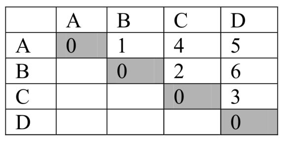
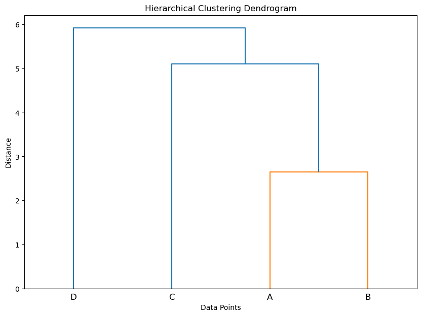
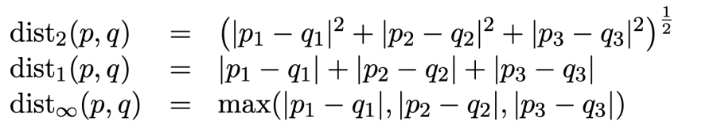
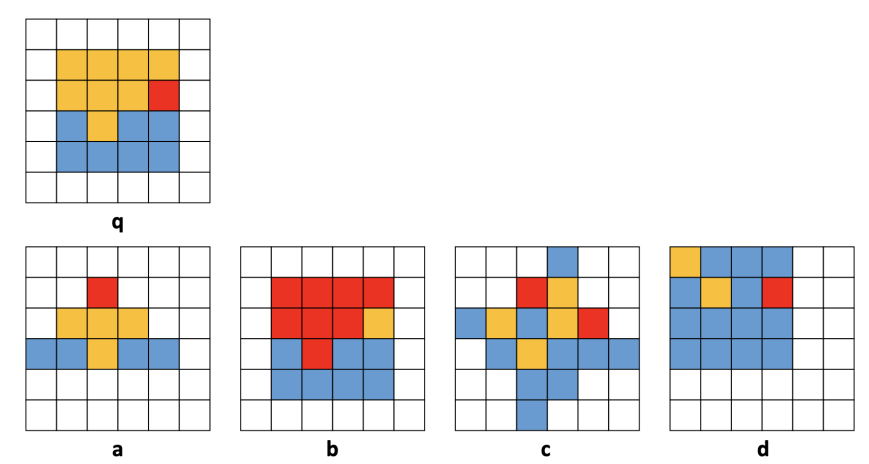

# clustering-exercise-

Algorithm, K-means, hierarchical clustering algorithm

**question 1**:
Using k-means algorithm and Euclidean distance, cluster the data from A1 to A8. To start, consider A1, A4, A7 as the center of clusters.

A1=(2,10), A2=(2,5), A3=(8,4), A4=(5,8), A5=(7,5), A6=(6,4), A7=(1,2), A8=(4,9)

For questions A, B and C, calculate the algorithm only once and then answer accordingly.

a) Show the new clusters as sets.

b) show the center of the new clusters with a star.

c) Draw a 10x10 coordinate diagram and draw the new clusters and centers after the first calculation of the algorithm.

d) How many times (epoch) is needed for the algorithm to reach convergence? (You can draw only the coordinate diagram of each stage for convenience, otherwise show the clusters as a set.)

**answer**

**a**:

solve this step by step using the k-means algorithm.

1. **Initialization**: We start with 3 initial clusters with centers at A1, A4, and A7.

2. **Assignment Step**: Assign each data point to the nearest cluster by calculating its distance to each centroid.

3. **Update Step**: Calculate the new centroids (mean) of the points in each cluster.

Let's calculate:

**Assignment Step**:

- Calculate the Euclidean distance from each point to the centroids A1, A4, and A7.

- For A2, the distances to A1, A4, and A7 are:

  $$d(A2, A1) = \sqrt{(2-2)^2 + (5-10)^2} = 5$$
  $$d(A2, A4) = \sqrt{(2-5)^2 + (5-8)^2} = \sqrt{18} \approx 4.24$$
  $$d(A2, A7) = \sqrt{(2-1)^2 + (5-2)^2} = \sqrt{10} \approx 3.16$$

  So, A2 is closest to A7.

- Repeat this process for all other points (A3, A5, A6, A8).

**Update Step**:

- After assigning all points to the closest centroid, recalculate the centroids as the mean of all points in the cluster.

- For example, if the points in the cluster of centroid A1 are {A1, A8}, the new centroid would be the average of these points.

This process is repeated until the centroids do not change significantly, or a certain number of iterations have been reached. For this question, we only need to calculate the algorithm once.

Please note that the k-means algorithm does not guarantee an optimal solution because it depends on the initial placement of the centroids. Therefore, the final solution might be a local optimum. To mitigate this, the algorithm is usually run multiple times with different initial placements. The most common result is chosen as the final solution.

"Show the new clusters as sets" means to present the final clusters after running the k-means algorithm once. Each cluster is a set of points that are closer to its centroid than to any other centroid.

For example, if we have three clusters with centroids at A1, A4, and A7, the sets might look something like this:

- Cluster 1 (Centroid A1): {A1, A8}
- Cluster 2 (Centroid A4): {A4, A2}
- Cluster 3 (Centroid A7): {A7, A3, A5, A6}

This is just an example. The actual sets will depend on the results of the k-means algorithm. Each set represents a cluster, and each element in the set is a data point assigned to that cluster.

**b:**

The center of the new clusters is calculated as the mean of the points within each cluster. After running the k-means algorithm once, you would calculate the mean of each cluster and that would be your new center.

For example, if Cluster 1 is {A1, A8}, the new center (let's call it C1\*) would be calculated as follows:

C1\* = ((x1+x8)/2, (y1+y8)/2)

Where (x1, y1) are the coordinates of A1 and (x8, y8) are the coordinates of A8.

You would repeat this process for each cluster to find the new centers. The new centers are often marked with a star (\*) to distinguish them from the original centers.

Please note that this is a simplified explanation. In practice, the k-means algorithm involves several iterations of the assignment and update steps until the centroids do not change significantly or a certain number of iterations have been reached.

**c:**

The image in c part is a scatter plot representing the results of the k-means clustering algorithm after one iteration. Here's what each element represents:

- **Points**: The points on the graph represent the data points you provided (A1 to A8). Each point is plotted according to its coordinates on the 2D plane.

- **Stars**: The stars on the graph represent the centers of the clusters after the first iteration of the k-means algorithm. These are the 'new' centroids calculated as the mean of the points in each cluster.

- **Colors**: Each color represents a different cluster. All points of the same color belong to the same cluster.

- **Grid and Marks**: The grid helps in visualizing the coordinates of the points and centroids. The marks from 0 to 10 on both axes represent the scale of the graph. They allow for precise placement and reading of the points and centroids.

<br>

**question 2**:Consider the following distance matrix for data A to D. Cluster the data using hierarchical clustering (agglomerative). and than Draw its dendrogram.



**answer:**

Performing hierarchical clustering on paper using the given distance matrix. Here are the steps:

1. **Initialization**: Start by treating each data point as a separate cluster. So, we have 4 clusters initially: {A}, {B}, {C}, and {D}.

2. **Find the Closest Clusters**: Look at the distances between all pairs of clusters. According to your distance matrix, the smallest distance is 1, between A and B. So, clusters {A} and {B} are the closest clusters.

3. **Merge the Closest Clusters**: Merge clusters {A} and {B} into a single cluster. Now, we have three clusters: {A, B}, {C}, and {D}.

4. **Update the Distance Matrix**: We need to update the distances from the new cluster {A, B} to all other clusters. Since we're using single linkage (also known as nearest point algorithm), the distance between two clusters is the shortest distance from any member of one cluster to any member of the other cluster. So, the distance from {A, B} to {C} is the minimum of the distance from A to C and the distance from B to C. Similarly, calculate the distance from {A, B} to {D}.

5. **Repeat Steps 2-4**: Repeat these steps until all data points are in a single cluster.

The dendrogram is a tree-like diagram that shows this process. Each merge is represented by a line connecting the two clusters that were merged. The height of the line is the distance between the two clusters.



**question 3:** Below are the types of distance measures of two vectors,





a) Obtain the vector of the above images based on the number of blue, red and yellow colors.

b) Using distance criteria, get the distance of images a, b, c, d from image q and determine the closest image to q.

c) Create a new feature vector for images in such a way that the best result is obtained using the arbitrary distance criterion from the above criteria.

**answer**:

a) Based on the image , we can count the number of each color in each grid to obtain the vectors. Here are the vectors for each image based on the number of blue, red, and yellow squares:

```python
a: [4, 1, 4]
b: [7, 8, 1]
c: [8, 1, 8]
d: [11, 2, 3]
q: [7, 1, 8]
```

Each vector represents the color composition of the corresponding image. The first element of the vector is the number of blue squares, the second element is the number of red squares, and the third element is the number of yellow squares.

b) It's explained in code

c) **Here's an explanation of the code and the question it addresses:**

The goal is to create modified feature vectors for images in a way that leads to the best results when using a chosen distance criterion to compare images. This involves experimenting with different transformations of the original feature vectors.

**Code Breakdown:**

1. **Import numpy:**

   - `import numpy as np` imports the NumPy library, essential for numerical computations and array operations.

2. **Define original image vectors:**

   - `image_vectors` is a dictionary storing the original feature vectors of the images, where keys are image names and values are arrays representing color counts (blue, red, yellow).

3. **Choose a distance criterion:**

   - `distance_criterion = dist2` selects the Euclidean distance (`dist2`) as the preferred criterion for comparing images.

4. **Create new feature vectors:**

   - `new_feature_vectors` will store the modified feature vectors.
   - The loop iterates through each image vector:
     - **Example 1: Vector normalization:**
       - `new_feature_vectors[image_name] = image_vector / np.linalg.norm(image_vector)` normalizes the vector by dividing each element by its L2-norm. This makes all vectors have a length of 1.
     - **Other examples (commented out):**
       - Rescaling to a specific range: Adjusts values to fall within a certain range like 0 to 1.
       - Non-linear transformations: Applies functions like logarithm or square root to feature values.

5. **Print new feature vectors:**
   - The code ends by printing the new, normalized feature vectors for each image.

**Key Points:**

- The code demonstrates vector normalization as one way to potentially improve image comparisons using a specific distance criterion.
- Other transformations (rescaling, non-linear) might be more suitable depending on the problem and distance metric.
- Determining the "best" transformation often involves experimentation and evaluation based on specific goals and datasets.

Imagine we have some images and want to find the one most similar to a specific reference image. To do this, we need a way to represent each image mathematically. This is where feature vectors come in! They act like descriptions of the images, containing information like the number of pixels of different colors.

Next, we need a way to tell how similar two images are based on their feature vectors. We can use a "distance metric" like Euclidean distance, which calculates a numerical value representing how different the vectors are. The smaller the distance, the more similar the images.

But here's the kicker: we can tweak the feature vectors themselves to potentially improve the accuracy of our comparisons! One way to do this is normalization, which essentially rescales the vectors to have a consistent "size." This can make the distance metric less sensitive to differences in overall color count and focus more on relative proportions.

We can also try other transformations, like rescaling the values to a certain range or applying mathematical functions like logarithms. These can alter the distribution of the numbers in the vector, potentially making it easier for the distance metric to distinguish between different types of images.

The best transformation to use will depend on the specific dataset and task at hand. The key is to experiment and find the approach that leads to the most accurate and helpful comparisons for your specific needs. So, go out there, explore different ways to represent and transform your image data, and see what you can uncover!
